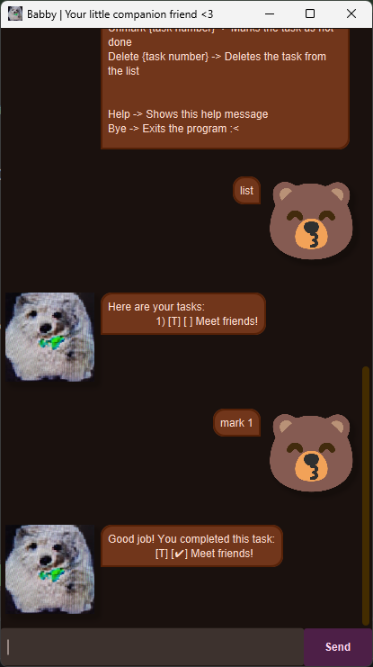

# Babby User Guide


Hello! Welcome to
```
 ______        _     _           _ 
(____  \      | |   | |         | |
 ____)  )_____| |__ | |__  _   _| |
|  __  ((____ |  _ \|  _ \| | | |_|
| |__)  ) ___ | |_) ) |_) ) |_| |_ 
|______/\_____|____/|____/ \__  |_|
                          (____/
```
Your little companion friend! Babby keeps track of your todos, deadlines, events and even phone contacts so you never miss a beat.

---
## Table of Contents
- [Quick start](#quick-start)
- [Features](#features)
  - [Getting help : `help`](#getting-help--help)
  - [Adding a todo : `todo`](#adding-a-todo--todo-task)
  - [Adding a deadline : `deadline`](#adding-a-deadline--deadline-task-by-ddmmyyyy-hhmm)
  - [Adding an event : `event`](#adding-an-event--event-task-from-ddmmyyyy-hhmm-to-ddmmyyyy-hhmm)
  - [Adding a friend : `friend`](#adding-a-friend--friend-name-number-phone-number)
  - [Listing tasks : `list`](#listing-tasks--list)
  - [Marking a task : `mark`](#marking-a-task--mark-index)
  - [Unmarking a task : `unmark`](#unmarking-a-task--unmark-index)
  - [Deleting a task : `delete`](#deleting-a-task--delete-index)
  - [Finding tasks : `find`](#finding-tasks--find-keyword)
  - [Exiting Babby : `bye`](#exiting-babby--bye)
- [Saving the data](#saving-the-data)
- [Editing the data file](#editing-the-data-file)
- [Command summary](#command-summary)

---
## Quick start
1. Ensure you have **Java 17** (or later) installed. You can verify this with `java -version`.
2. Download the latest release of `Babby.jar` from [here](https://github.com/jj910/ip/releases).
3. Place `Babby.jar` in any folder you want to act as Babby’s home directory.
4. Double-click `Babby.jar`, or run `java -jar Babby.jar` from a terminal.
5. Type a command into the input box. Start with `help` if you’re unsure what to do next.
6. Press Enter on your keyboard or click `Send` to execute the command and see Babby’s response in the conversation area.

---
## Features
Each command is entered in the GUI input box. Babby is case-insensitive for the command word but keeps the rest of the text as-is.

### Getting help : `help`
Shows a list of available commands and their formats.

Expected outcome:
```
Here are the commands you can use:
ToDo {task} -> Adds a todo task
Deadline {task} /by {DD/MM/YYYY HHMM} -> Adds a deadline task
Event {task} /from {DD/MM/YYYY HHMM} /to {DD/MM/YYYY HHMM} -> Adds an event task
Friend {name} /number {phone number} -> Adds a friend to your friend list
...
Bye -> Exits the program :<
```

### Adding a todo : `todo <task>`
Adds a basic task without any date or time.

Example: `todo Read a book`

Expected outcome:
```
Okay, I've added this task:
  [T][ ] Read a book
You have N tasks in the list now!
```

### Adding a deadline : `deadline <task> /by <DD/MM/YYYY HHMM>`
Adds a task that must be completed before a specific date/time. The time uses 24-hour format.

Example: `deadline CS2103 quiz /by 31/03/2026 2359`

Expected outcome:
```
Okay, I've added this task:
  [D][ ] CS2103 quiz (By: 31/03/2026 2359)
You have N tasks in the list now!
```

### Adding an event : `event <task> /from <DD/MM/YYYY HHMM> /to <DD/MM/YYYY HHMM>`
Tracks something happening between two timestamps.

Example: `event Hackathon /from 05/04/2026 0900 /to 05/04/2026 2100`

Expected outcome:
```
Okay, I've added this task:
  [E][ ] Hackathon (From: 05/04/2026 0900 To: 05/04/2026 2100)
You have N tasks in the list now!
```

### Adding a friend : `friend <name> /number <phone number>`
Stores an important contact alongside your tasks.

Example: `friend Alice /number 91234567`

Expected outcome:
```
Okay, I've added this friend:
  [F][ ] Alice (Contact: 91234567)
You have N tasks/friends in the list now!
```

### Listing tasks : `list`
Displays every item in the current task list with numbering.

Example: `list`

Expected outcome:
```
Here are your tasks:
    1) [T][ ] Read a book
    2) [F][ ] Alice (Contact: 91234567)
```

### Marking a task : `mark <index>`
Marks the numbered task as completed. The index is shown in the `list` command.

Example: `mark 2`

Expected outcome:
```
Good job! You completed this task:
    [T][✔] Read a book
```

### Unmarking a task : `unmark <index>`
Sets a previously completed task back to “not done”.

Example: `unmark 1`

Expected outcome:
```
Okay, you need to do this task:
    [T][ ] Read a book
```

### Deleting a task : `delete <index>`
Removes the specified task permanently.

Example: `delete 3`

Expected outcome:
```
Okies, I deleted this task:
    [F][ ] Alice (Contact: 91234567)
You have N tasks in the list now!
```

### Finding tasks : `find <keyword>`
Searches titles and descriptions for the provided keyword (case-insensitive).

Example: `find project`

Expected outcome:
```
Here are the matching tasks in your list:
    1) [T][ ] CS2103 project
```

### Exiting Babby : `bye`
Says goodbye and closes the application.

Example: `bye`

Expected outcome:
```
Byebyee! See you again soon!
```
After which, the app will close.

---
## Saving the data
Babby automatically saves your task list to `data/tasks.txt` after every change (add, mark, delete, etc.). There is no separate save command. The same file is read when the app starts, so your data persists across sessions.

---
## Editing the data file
Advanced users can edit `data/tasks.txt` directly. Each line follows one of these formats:
- todo task: `T | {0/1} | description`
- deadline task: `D | {0/1} | description | 2026-03-31T23:59`
- event task: `E | {0/1} | description | 2026-04-05T09:00 | 2026-04-05T21:00`
- friend: `F | {0/1} | name | 91234567`

`0` means “not done”, `1` means “done”. Always use ISO-8601 datetimes for deadlines/events. If Babby encounters an invalid line while loading, it skips that entry and logs a warning.

---
## Command Summary
| Command | Format | Example |
| --- | --- | --- |
| Help | `help` | `help` |
| Todo | `todo <task>` | `todo finish iP` |
| Deadline | `deadline <task> /by <DD/MM/YYYY HHMM>` | `deadline submit report /by 12/04/2026 1800` |
| Event | `event <task> /from <DD/MM/YYYY HHMM> /to <DD/MM/YYYY HHMM>` | `event camp /from 01/06/2026 0800 /to 03/06/2026 1200` |
| Friend | `friend <name> /number <phone>` | `friend Bob /number 81234567` |
| List | `list` | `list` |
| Mark | `mark <index>` | `mark 2` |
| Unmark | `unmark <index>` | `unmark 2` |
| Delete | `delete <index>` | `delete 1` |
| Find | `find <keyword>` | `find alice` |
| Exit | `bye` | `bye` |
